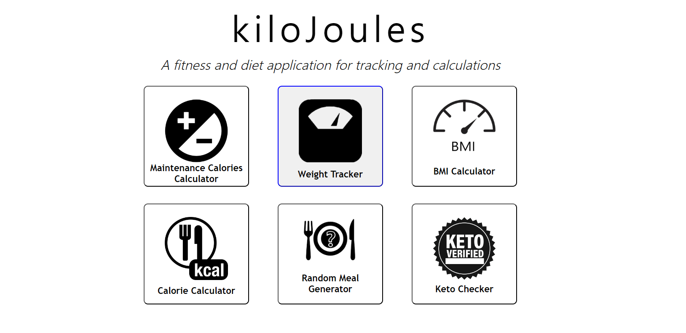
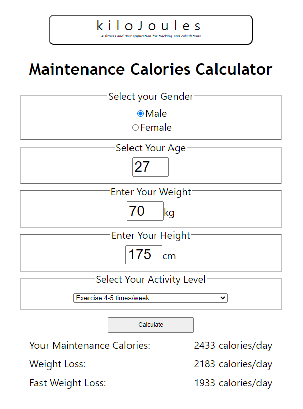
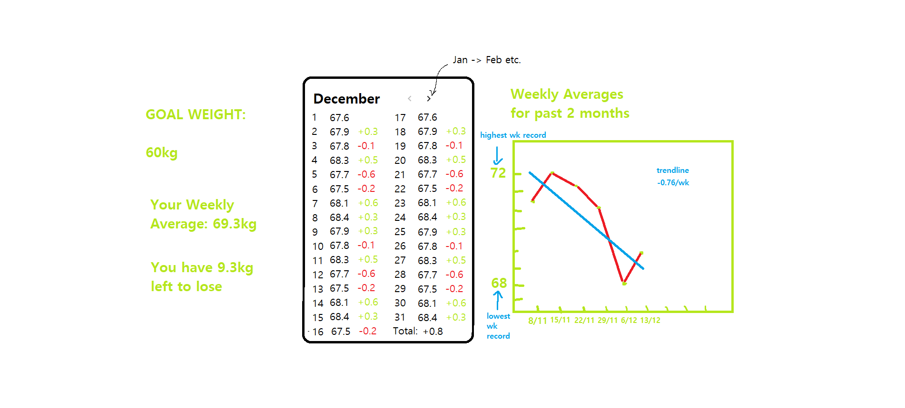
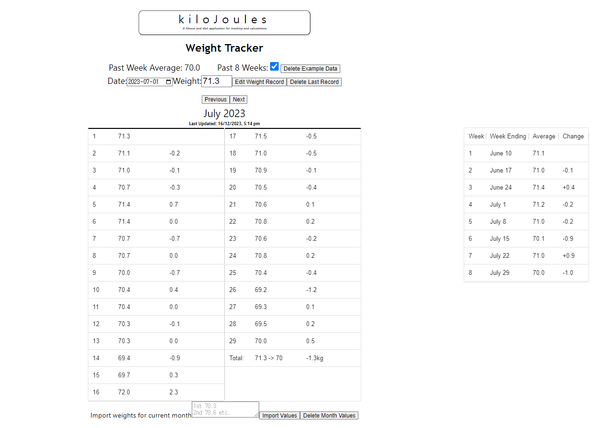
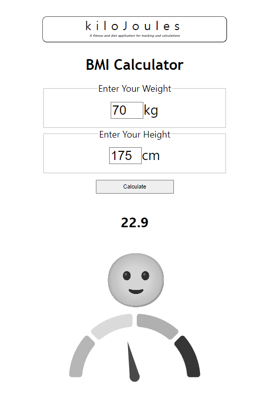
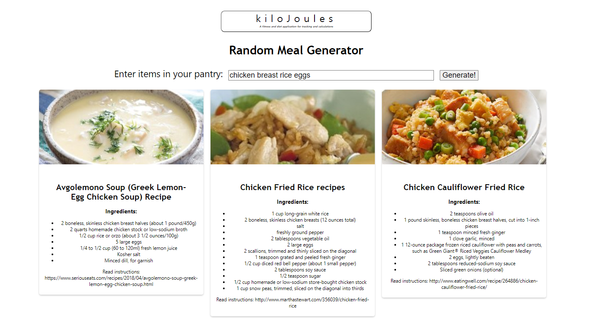
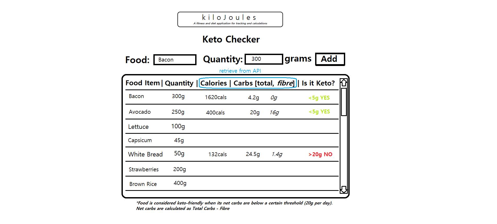
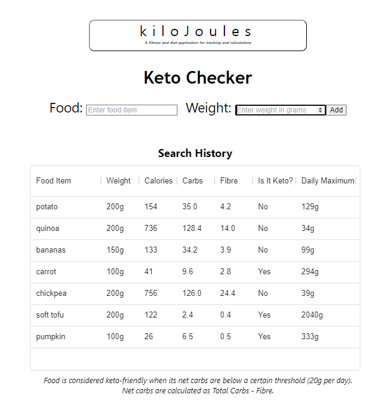

# kiloJoules - Diet and Fitness

### _A fitness and diet application for tracking and calculations_

Try out this project here: https://elderlyc.github.io/fitness-app/

## Introduction

kiloJoules was my first major project after having spent time learning JavaScript, HTML, CSS, and finally React basics.

The application features 6 self-contained pages with varying functions, from a calorie calculator to a meal generator.

Creating this project was a way for me to learn as I went about implementing various functionality and designs.

I was able to become familiar with the use of RESTful APIs by fetching food data from the Edamam database.

I also utilised localStorage, dealing with JSON and nested objects in the process, to store various data across sessions.

Custom components and hooks were applied for various elements of the application. Implementing routing allowed me to achieve a Single-Page Application.

Although visually basic, this was intentional as I wished to focus mostly on functionality over form.

## Wireframes to Pages

At first I used Paint to sketch out my ideas for the various sections of my application. Later Figma helped me understand visually what I wanted to accomplish.
Below are some screenshots from my application in use.

### Home page

 

I managed to follow my sketches for the home page almost exactly, except for some minor aesthetic changes. Below is the finished application:

### Maintenance calories calculator

### Weight tracker

Some functions from the planning stage were canned, others added as I worked out what would be most useful.

### BMI calculator

### Calorie calculator

Again, I narrowed the scope of the application's functions to make it less cluttered and focused.

### Random meal generator

### Keto checker

Another example where more features were added later in production:

## The Programmer

Hi. I study programming by myself through online resources and am looking for a web development job. I have experience with React (JS, HTML, CSS), Git, and Firebase, and am studying TypeScript and Node.js.

I am always striving to learn about the seemingly endless world of programming, and try to program every day.

## My Other Projects

My most recently completed project _**Meetup Mannaja**_ is something I use with my friends to organise gatherings.

You can try it out here: https://elderlyc.github.io/meetup-app

## Special Thanks

To Mike and Baker for giving me ideas and helping test out my application, and everyone else for trying it out.
